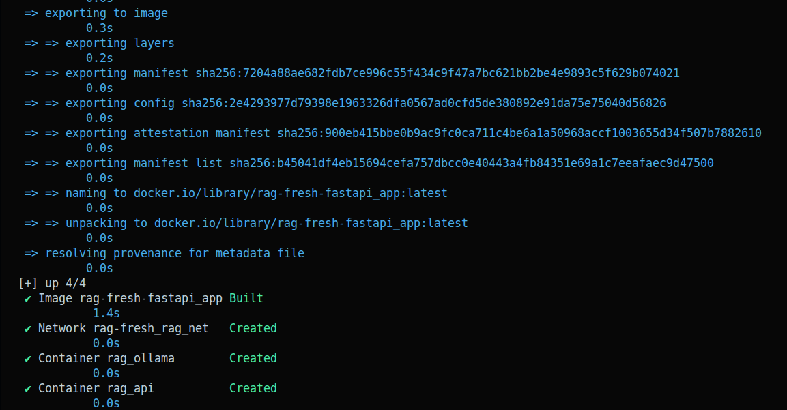
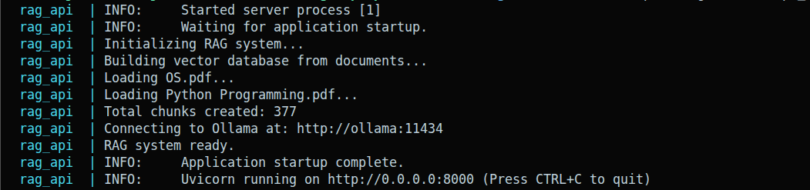
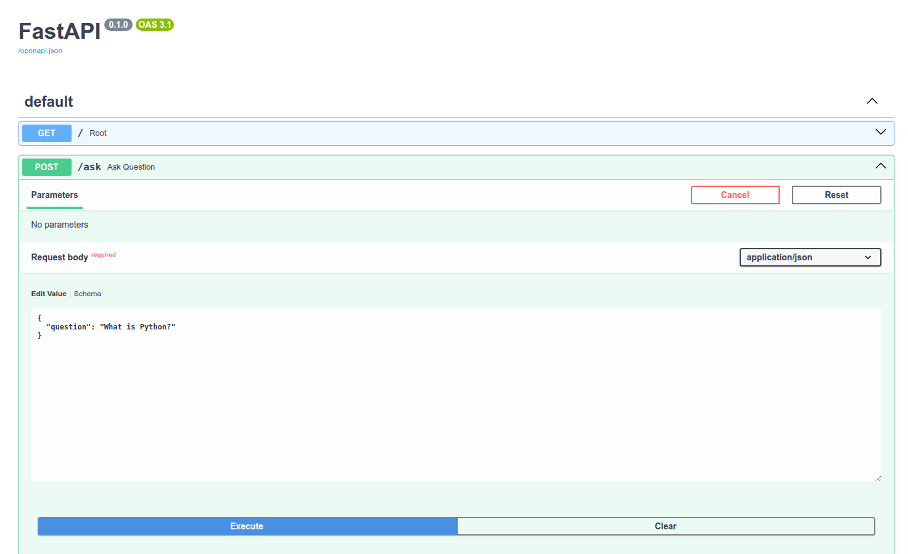
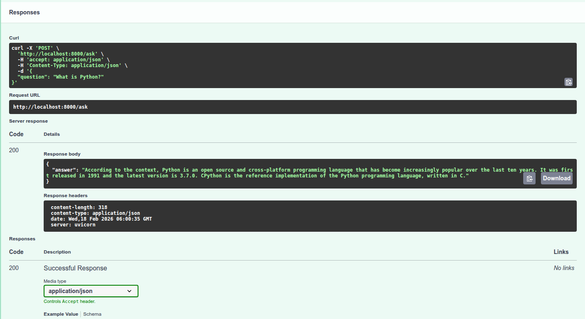

# 🧠 Local RAG System using Ollama + FastAPI

A fully **local**, **privacy-first** Retrieval-Augmented Generation (RAG) system that answers questions from your PDF documents using open-source LLMs — no cloud, no API keys, no data leaving your machine.

> 🎥 **[Watch Demo Video](https://your-demo-link-here.com)** ← *(update this link)*

---
## 🧩 Problem this solves
Traditional LLMs hallucinate or lack domain context.
This project grounds responses using local PDFs via RAG.

## 📸 Screenshots

### 🐳 Docker Setup & Build


### 📋 Server Logs — RAG Initialization


### 🌐 FastAPI Swagger UI


### ✅ API Response in Action


---

## 🏗️ Architecture Overview

```
PDF Documents
     │
     ▼
 PDF Loader (PyPDF)
     │
     ▼
 Text Chunker (RecursiveCharacterTextSplitter)
     │
     ▼
 Embeddings (nomic-embed-text via Ollama)
     │
     ▼
 Vector Store (ChromaDB)
     │
     ▼
 Retriever (Top-K similarity search)
     │
     ▼
 LLM (llama3.2 via Ollama)
     │
     ▼
 Answer via FastAPI /ask endpoint
```

---

## ✨ Features

- 🔒 **100% Local** — All processing happens on your machine
- 📄 **Multi-PDF Support** — Drop multiple PDFs into `data/docs/`
- ⚡ **FastAPI Backend** — Clean REST API with auto-generated Swagger docs
- 🗄️ **Persistent Vector DB** — ChromaDB persists embeddings between runs
- 🐳 **Dockerized** — One command to spin everything up
- 🧠 **Hallucination Control** — Low-temperature generation with "I don't know" fallback

---

## 🛠️ Tech Stack

| Component | Technology |
|---|---|
| LLM & Embeddings | [Ollama](https://ollama.com) (`llama3.2`, `nomic-embed-text`) |
| Vector Store | [ChromaDB](https://www.trychroma.com) |
| RAG Framework | [LangChain](https://www.langchain.com) |
| API Server | [FastAPI](https://fastapi.tiangolo.com) + Uvicorn |
| Containerization | Docker + Docker Compose |

---

## 🚀 Getting Started

### Prerequisites

- [Docker](https://docs.docker.com/get-docker/) & Docker Compose installed
- At least **8GB RAM** recommended

### 1. Clone the Repository

```bash
git clone https://github.com/Vishwajeeet/RAG-Powered-Knowledge-Retrieval-System.git
cd RAG-Powered-Knowledge-Retrieval-System
```

### 2. Add Your PDF Documents

```bash
mkdir -p data/docs
cp your-document.pdf data/docs/
```

### 3. Start All Services

```bash
docker compose up --build
```

This will:
- Pull and start the **Ollama** model server
- Build and start the **FastAPI** application
- Automatically load PDFs and build the vector database on first run

### 4. Pull Required Models

In a separate terminal (only needed once):

```bash
docker exec -it rag_ollama ollama pull llama3.2
docker exec -it rag_ollama ollama pull nomic-embed-text
```

### 5. Access the API

| Interface | URL |
|---|---|
| Swagger UI | http://localhost:8000/docs |
| API Root | http://localhost:8000/ |
| Ask Endpoint | `POST` http://localhost:8000/ask |

---

## 📡 API Usage

### Ask a Question

```bash
curl -X POST http://localhost:8000/ask \
  -H "Content-Type: application/json" \
  -d '{"question": "What is Python?"}'
```

**Response:**
```json
{
  "answer": "According to the context, Python is an open source and cross-platform programming language..."
}
```

---

## 📁 Project Structure

```
.
├── app/
│   ├── main.py           # FastAPI app & endpoints
│   └── rag_core.py       # RAG logic: loading, embedding, retrieval, generation
├── data/
│   └── docs/             # 📂 Place your PDF files here
├── chroma_db_local/      # Auto-generated vector database (persisted)
├── screenshots/          # Project screenshots
├── Dockerfile
├── docker-compose.yml
├── requirements.txt
└── README.md
```

---

## ⚙️ Configuration

Key settings in `rag_core.py`:

| Variable | Default | Description |
|---|---|---|
| `OLLAMA_BASE_URL` | `http://ollama:11434` | Ollama service URL |
| `EMBEDDING_MODEL` | `nomic-embed-text` | Model used for embeddings |
| `CHAT_MODEL` | `llama3.2` | LLM for answer generation |
| `VECTOR_DB_DIR` | `./chroma_db_local` | ChromaDB persistence path |
| `chunk_size` | `1000` | Text chunk size in characters |
| `chunk_overlap` | `200` | Overlap between chunks |
| `k` (retriever) | `7` | Number of chunks retrieved per query |

---

## 🔄 Rebuilding the Vector Database

If you add new PDFs or switch documents, delete the existing database and restart:

```bash
rm -rf chroma_db_local
docker compose restart fastapi_app
```

---

## 🎯 Design Decisions

- **Low temperature (0.1)** generation to minimize hallucination
- **Explicit "I don't know" fallback** when context doesn't contain the answer
- **Separated retrieval and generation** stages for clarity and debuggability
- **Persistent ChromaDB** to avoid re-embedding on every restart
- **Docker networking** (`rag_net`) for secure inter-service communication

---

## 📄 License

MIT License — feel free to use, modify, and distribute.

---

<p align="center">Built with ❤️ using Ollama, LangChain, ChromaDB & FastAPI</p>